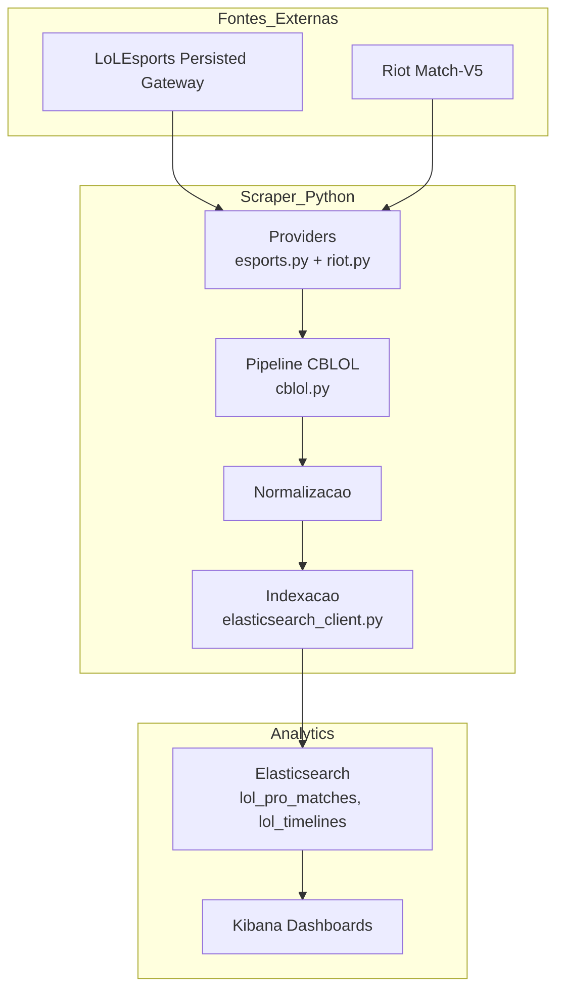

# Arquitetura do Scraper

Este documento descreve o fluxo de dados e os serviços do scraper de partidas profissionais.

## Visão Geral

## Componentes

- `providers/esports.py`: integrações com o LoLEsports (Persisted Gateway).
- `providers/riot.py`: integrações com Riot Match/Account V5 (inclui autenticação via `RIOT_API_KEY`).
- `pipelines/cblol.py`: orquestra a ingestão (descoberta de jogos, normalização e indexação).
- `indexers/elasticsearch_client.py`: cliente e helpers para bulk/indices.
- `indexers/mappings.py`: mapeamentos dos índices `lol_pro_matches` e `lol_timelines`.

## Observações

- Novos campeões são ingeridos automaticamente via `championName` do Match-V5.
- Para scripts auxiliares, o mapeamento `championId -> name` é atualizado via Data Dragon (`providers/ddragon.py`).
- Variáveis sensíveis (e.g., `RIOT_API_KEY`) devem ser definidas em `.env` e nunca commitadas.