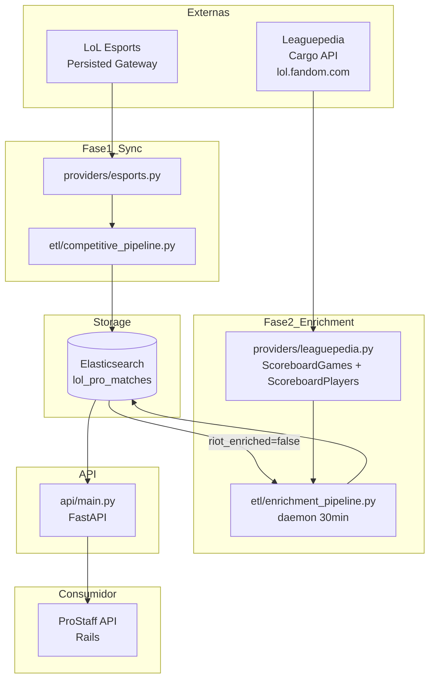

# Arquitetura do Scraper

Fluxo de dados e servicos do scraper de partidas profissionais.

---

## Visao Geral

O sistema opera em duas fases independentes:

1. **Sync** — busca partidas do calendário competitivo via LoL Esports API e indexa no Elasticsearch com `riot_enriched: false`
2. **Enrichment** — daemon background que enriquece cada partida com stats por jogador (champion, KDA, items, runas) via Leaguepedia



---

## Por que Leaguepedia em vez de Riot Match-V5

Partidas do CBLOL (e outros torneios oficiais) sao disputadas em servidores internos
da Riot para esports — esses jogos **nao aparecem na API publica Match-V5**.

O Riot ID do jogador `tinowns#BR1` exibe a ultima partida em dezembro/2025, mesmo
durante a temporada ativa de fevereiro/2026. Esse e o comportamento esperado para
contas de torneio, que sao contas separadas.

Leaguepedia recebe os dados oficiais pelo **programa de divulgacao de dados da Riot**
e os expoe via Cargo API (MediaWiki). E a unica fonte publica com:
- Stats por jogador (champion, KDA, gold, CS, dano)
- Items por nome
- Runas por nome (keystone + runes primarias/secundarias + shards)
- Summoner spells por nome
- Winner por partida

---

## Componentes

### Providers

| Arquivo | Responsabilidade |
|---|---|
| `providers/esports.py` | LoL Esports Persisted Gateway: listar ligas, buscar eventos concluidos (`getCompletedEvents`) |
| `providers/leaguepedia.py` | Leaguepedia Cargo API: `get_game_scoreboard()`, `get_game_players()`, `get_game_data()` |
| `providers/riot.py` | Riot Account/Match V5 (usado apenas para lookup de contas, nao para enrichment) |
| `providers/riot_rate_limited.py` | Cliente Riot com rate limiting por tier (dev/prod) |

### ETL

| Arquivo | Responsabilidade |
|---|---|
| `etl/competitive_pipeline.py` | Fase 1: busca eventos do LoL Esports, normaliza, indexa no ES com `riot_enriched: false` |
| `etl/enrichment_pipeline.py` | Fase 2: daemon que processa games pendentes via Leaguepedia, atualiza ES com participants |

### Indexers

| Arquivo | Responsabilidade |
|---|---|
| `indexers/elasticsearch_client.py` | `get_client()`, `bulk_index()`, `update_document()`, `query_unenriched()` |
| `indexers/mappings.py` | Mapeamentos dos indices `lol_pro_matches` e `lol_timelines` |

### API

| Arquivo | Responsabilidade |
|---|---|
| `api/main.py` | FastAPI: endpoints de query, sync e enrichment |

---

## Fluxo Detalhado

### Fase 1 — Sync (scraper-cron)

```
LoL Esports getCompletedEvents(leagueId)
  └─ retorna series com games[], cada game tem vods[].parameter (YouTube ID)
       └─ competitive_pipeline.py
            ├─ filtra por liga (CBLOL, LCS, etc.)
            ├─ para cada game: cria documento CompetitiveGame
            │    {match_id, game_number, league, team1, team2,
            │     start_time, vod_youtube_id, riot_enriched: false}
            └─ bulk_index() → Elasticsearch lol_pro_matches
```

### Fase 2 — Enrichment (enrichment-daemon)

```
A cada 30 minutos:
  query_unenriched(size=50) → games com riot_enriched=false

  Para cada game:
    1. get_game_scoreboard(team1, team2, date, game_number)
         → ScoreboardGames: GameId (page_name), WinTeam, Patch, Gamelength

    2. sleep(9s) — rate limit Leaguepedia ~1 req/8s

    3. get_game_players(page_name)
         → ScoreboardPlayers: Name, Team, Champion, Role,
           K/D/A, Gold, CS, Damage, Items, Runes, SummonerSpells

    4. update_document(ES, doc_id, {
         riot_enriched: true,
         participants: [...10 players...],
         patch, win_team, gamelength, game_duration_seconds,
         enrichment_source: "leaguepedia"
       })

    5. sleep(9s) — entre games

  Falha: incrementa enrichment_attempts (max 3 antes de desistir)
```

---

## Documento ES — Estrutura Final

```json
{
  "match_id": "115565621821672075",
  "game_number": 2,
  "league": "CBLOL",
  "stage": "Play-Ins",
  "start_time": "2026-02-03T21:00:00Z",
  "team1": { "name": "LEVIATÁN", "code": "LEV", "game_wins": 3 },
  "team2": { "name": "paiN Gaming", "code": "PNG", "game_wins": 1 },
  "vod_youtube_id": "abc123",
  "riot_enriched": true,
  "enrichment_source": "leaguepedia",
  "leaguepedia_page": "CBLOL/2026 Season/Cup_Play-In Last Chance_1_2",
  "patch": "26.02",
  "win_team": "Leviatan",
  "gamelength": "32:43",
  "game_duration_seconds": 1963,
  "enriched_at": "2026-02-26T05:27:25Z",
  "participants": [
    {
      "summoner_name": "tinowns",
      "team_name": "paiN Gaming",
      "champion_name": "Ahri",
      "role": "Mid",
      "kills": 4, "deaths": 1, "assists": 3,
      "gold": 14320, "cs": 245, "damage": 22100,
      "win": false,
      "items": ["Rabadon's Deathcap", "Shadowflame", "Void Staff"],
      "summoner_spells": ["Flash", "Ignite"],
      "keystone": "Electrocute",
      "primary_runes": ["Cheap Shot", "Eyeball Collection", "Treasure Hunter"],
      "secondary_runes": ["Presence of Mind", "Cut Down"],
      "stat_shards": ["Adaptive Force", "Adaptive Force", "Health"]
    }
  ]
}
```

---

## Servicos Docker (Producao)

| Servico | Imagem | Funcao |
|---|---|---|
| `scraper-api` | Dockerfile.production | FastAPI em `:8000`, exposto via Traefik/HTTPS |
| `scraper-cron` | Dockerfile.production | `etl/competitive_pipeline.py --daemon --interval 1` |
| `enrichment-daemon` | Dockerfile.production | `etl/enrichment_pipeline.py --daemon --interval 30 --batch 50` |
| `elasticsearch` | Servico separado Coolify | Armazenamento de partidas |

---

## Rate Limiting

| API | Limite | Estrategia |
|---|---|---|
| Leaguepedia Cargo (anonimo) | ~1 req/8s | `tenacity` wait_fixed(9s) + sleep explicito entre requests |
| LoL Esports Persisted Gateway | Alta | tenacity exponential backoff |
| Riot Account/Match V5 | 20 req/1s (dev), 100 req/1s (prod) | `riot_rate_limited.py` com controle por tier |

---

## Observacoes

- **`riot_enriched`**: o campo se chama assim por razoes historicas (antes tentavamos usar Match-V5). Semanticamente significa "enriched with per-player stats".
- **Nomes vs IDs**: Leaguepedia retorna nomes de items, runas e spells como strings (ex: `"Conqueror"`, `"Black Cleaver"`). Isso e preferivel a IDs numericos porque nao requer mapeamento com Data Dragon.
- **Collation MySQL**: o Cargo API do Leaguepedia usa collation `utf8_unicode_ci`, portanto `LEVIATÁN = Leviatan = leviatan` nas queries WHERE. Isso resolve divergencias de acento entre o nome no LoL Esports e o nome no Leaguepedia.
- **Variaveis sensiveis**: `RIOT_API_KEY`, `ESPORTS_API_KEY`, `SCRAPER_API_KEY` devem estar em `.env` e nunca commitados.
